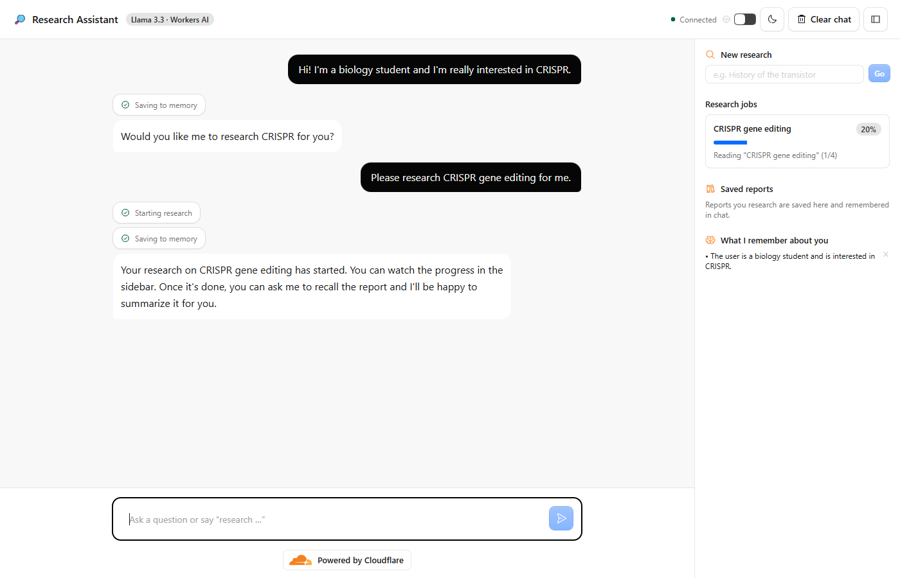
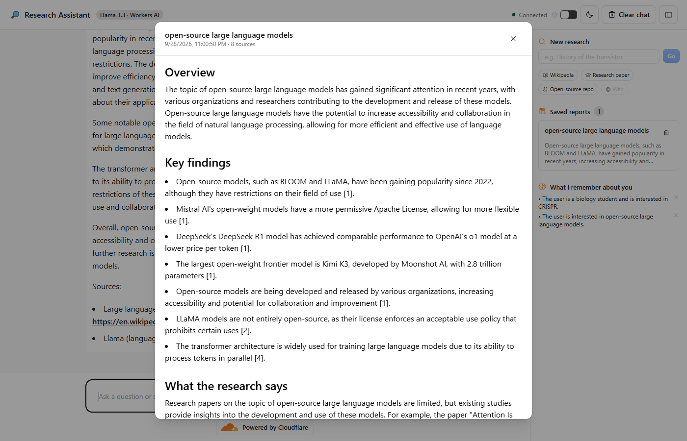
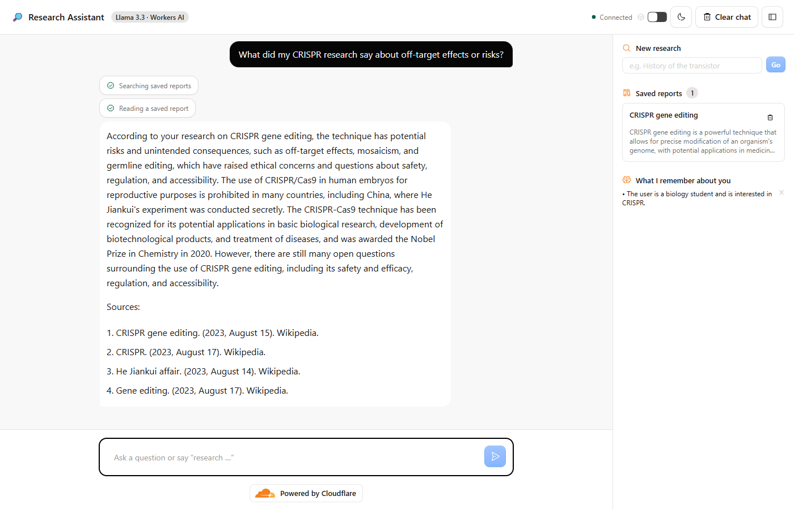

# cf_ai_research_assistant

An AI research assistant built entirely on Cloudflare. You chat with it, ask it
to research a topic, and it runs a durable multi-step research pipeline in the
background. It searches Wikipedia, research papers, open-source GitHub
repositories, and the web, reads the best sources, takes notes, and writes a
cited report. Reports and facts about you are saved to memory, so later
conversations can build on earlier research.



## How it meets the assignment

| Requirement                 | Implementation                                                                                                                                                                                                                                                                      |
| --------------------------- | ----------------------------------------------------------------------------------------------------------------------------------------------------------------------------------------------------------------------------------------------------------------------------------- |
| **LLM**                     | Llama 3.3 70B (`@cf/meta/llama-3.3-70b-instruct-fp8-fast`) on Workers AI, called through the AI SDK and `workers-ai-provider`. It drives the chat, tool calling, query planning, note taking, and report writing.                                                                   |
| **Workflow / coordination** | `ResearchWorkflow`, a Cloudflare Workflow (`AgentWorkflow`) with checkpointed, retried steps: plan → gather from 4 source types in parallel → read each source → write → save. The `ResearchAgent` Durable Object starts it and receives progress, completion, and error callbacks. |
| **User input via chat**     | A React chat UI served as static assets by the same Worker. It talks to the agent over a WebSocket with `useAgent` and `useAgentChat`, and streams responses token by token.                                                                                                        |
| **Memory / state**          | Per-user SQLite inside the agent's Durable Object: chat history, saved reports, and remembered facts. Live research progress is agent state that syncs to every open tab.                                                                                                           |

## Research sources

| Source            | API                                                             | What it contributes                                                    | Key                                               |
| ----------------- | --------------------------------------------------------------- | ---------------------------------------------------------------------- | ------------------------------------------------- |
| Wikipedia         | MediaWiki search + extracts                                     | Background and definitions                                             | None                                              |
| Research papers   | [OpenAlex](https://openalex.org) (250M+ works, including arXiv) | Abstracts, year, citation count, DOI. Well-cited papers are preferred. | None                                              |
| Open-source repos | GitHub search + README                                          | What real projects do and how they relate to the topic                 | Optional `GITHUB_TOKEN` (raises the rate limit)   |
| Web search        | [Tavily](https://tavily.com)                                    | Current pages: news, blogs, docs                                       | `TAVILY_API_KEY` (free tier). Skipped without it. |

Each report reads up to 8 sources: up to 2 each of papers, repos, and web
pages, with Wikipedia filling the remaining slots. Each source type is its own
workflow step. If one fails or is rate-limited, the report is still written
from the others. The sidebar shows which sources are on, and each source in a
report is labeled with its type and metadata.

## Architecture

```
Browser (React chat + research sidebar)
   │  WebSocket: chat stream, state sync, RPC (@callable)
   ▼
ResearchAgent  (AIChatAgent → Durable Object, one instance per browser)
   ├─ Llama 3.3 chat with tools: startResearch, searchReports, getReport, rememberFact
   ├─ SQLite: messages · reports · memories
   ├─ state.jobs → live progress in the sidebar
   │
   │ runWorkflow()                ▲ onWorkflowProgress / Complete / Error
   ▼                              │ saveReport() over RPC
ResearchWorkflow  (Cloudflare Workflow)
   1. plan-queries     Llama 3.3 turns the topic into search queries
   2. gather-*         in parallel: Wikipedia · OpenAlex papers · GitHub repos · Tavily web
   3. read-*           in parallel: fetch each source, Llama 3.3 extracts notes
                       with instructions tuned to the source type
   4. write-report     Llama 3.3 writes a cited Markdown brief + summary, with
                       sections for papers and open-source projects when present
   5. save-report      stored in the agent's SQLite, announced in chat
```

Design choices:

- **Why a Workflow for research?** A research run makes about ten LLM and HTTP
  calls and can take a minute or more. Each `step.do()` is checkpointed and
  retried with exponential backoff, so a flaky fetch or a restart resumes
  from the last finished step instead of starting over. The chat stays
  responsive while it runs.
- **Why one agent per browser?** The client stores a random session ID in
  `localStorage` and uses it as the agent instance name. Each user gets an
  isolated SQLite database with no shared session store.
- **Grounded answers.** The report prompt allows only facts from the extracted
  notes and cites them as `[1]`, `[2]`. Follow-up questions go through
  `searchReports` and `getReport`, so answers come from saved reports rather
  than the model's memory.
- **Works without any keys.** Wikipedia, OpenAlex, and GitHub need no API key,
  so anyone can run the project with just a Cloudflare account. Web search
  turns on when a Tavily key is added.

## Making Llama 3.3 reliable

End-to-end testing in a real browser turned up problems that prompts alone
did not fix. Each one now has a code-level fix:

| Problem found in testing                                                                                                                                                                                                             | Fix                                                                                                                                  |
| ------------------------------------------------------------------------------------------------------------------------------------------------------------------------------------------------------------------------------------ | ------------------------------------------------------------------------------------------------------------------------------------ |
| Streamed replies showed every word twice, and tool calls arrived with empty arguments (`{}`) and failed. Workers AI sends each streamed chunk in both OpenAI-style and legacy fields, and `workers-ai-provider` 3.x/4.0 parses both. | [src/ai.ts](src/ai.ts) wraps the `AI` binding and removes the legacy copies from streamed chunks.                                    |
| The model kept calling tools in a loop and hit the step limit without replying.                                                                                                                                                      | `prepareStep` lets `startResearch` and `rememberFact` run once per turn, and removes all tools from step 4 so the model must answer. |
| The model started research when the user only mentioned an interest.                                                                                                                                                                 | `startResearch` checks that the latest user message actually asks for research.                                                      |
| Repeated calls in one turn started duplicate jobs, which then hit Wikipedia's rate limit (HTTP 429).                                                                                                                                 | Jobs are deduplicated by topic, at most 2 run at once, and workflow steps back off exponentially.                                    |
| The same fact was saved several times.                                                                                                                                                                                               | Facts are normalized and deduplicated before they are saved.                                                                         |

## Project layout

| File                               | Purpose                                                                               |
| ---------------------------------- | ------------------------------------------------------------------------------------- |
| [src/server.ts](src/server.ts)     | `ResearchAgent`: chat, tools, memory (SQLite), workflow callbacks, Worker entry point |
| [src/workflow.ts](src/workflow.ts) | `ResearchWorkflow`: the durable research pipeline                                     |
| [src/sources.ts](src/sources.ts)   | Source adapters: Wikipedia, OpenAlex, GitHub, Tavily                                  |
| [src/ai.ts](src/ai.ts)             | Workers AI provider wrapper that fixes duplicated stream chunks                       |
| [src/shared.ts](src/shared.ts)     | Model ID and types shared by server and client                                        |
| [src/app.tsx](src/app.tsx)         | React UI: chat, research sidebar, report viewer                                       |
| [wrangler.jsonc](wrangler.jsonc)   | Bindings: Workers AI, Durable Object, Workflow, static assets                         |
| [PROMPTS.md](PROMPTS.md)           | AI prompts used to build the project and the prompts the app sends to Llama 3.3       |

## Running locally

Prerequisites:

- Node.js 22 or newer
- A Cloudflare account (the free plan works)

Workers AI has no local emulator, so even local development calls the real
model and needs you to log in.

```sh
git clone <this-repo-url> cf_ai_research_assistant
cd cf_ai_research_assistant
npm install
npx wrangler login     # opens a browser to authorize Wrangler
cp .dev.vars.example .dev.vars   # optional: add TAVILY_API_KEY / GITHUB_TOKEN
npm run dev
```

Open http://localhost:5173.

Both keys in `.dev.vars` are optional. `.dev.vars` is gitignored, so keys
never reach the repository.

## Deploying

```sh
npm run deploy
```

This builds the client and deploys the Worker, Durable Object, and Workflow.
Wrangler prints the public `*.workers.dev` URL. To enable the optional
sources in production:

```sh
npx wrangler secret put TAVILY_API_KEY
npx wrangler secret put GITHUB_TOKEN
```

## Try it

1. **"I'm a biology student interested in CRISPR."** The agent calls
   `rememberFact`, and the fact appears under _What I remember about you_.
2. **"Research CRISPR gene editing."** The agent calls `startResearch`. A job
   card in the sidebar shows each workflow step live. After about a minute, a
   summary is posted in the chat and the report is saved.
3. **Open the report** from the sidebar to see the cited brief, sources, and
   the notes taken from each source.

   

4. **Reload the page or come back later** and ask _"What did my CRISPR research
   say about off-target effects?"_ The agent searches its saved reports and
   answers from them.

   

## Useful commands

| Command          | What it does                                         |
| ---------------- | ---------------------------------------------------- |
| `npm run dev`    | Local dev server (Vite + workerd)                    |
| `npm run deploy` | Build and deploy to Cloudflare                       |
| `npm run types`  | Regenerate `env.d.ts` after editing `wrangler.jsonc` |
| `npm run check`  | Format check, lint, and type check                   |

## Credits

Scaffolded from Cloudflare's
[`agents-starter`](https://github.com/cloudflare/agents-starter) template
(MIT). The agent, workflow, memory, and UI were rewritten for this project.
